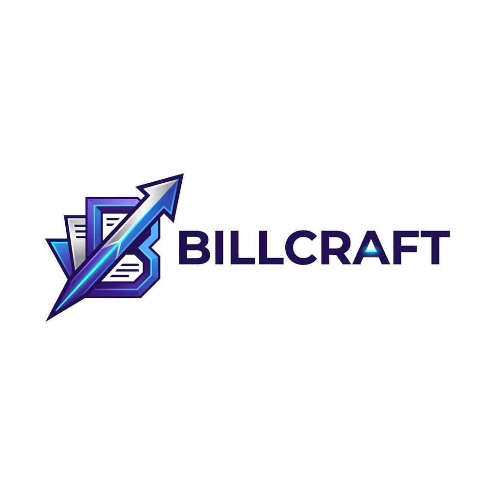
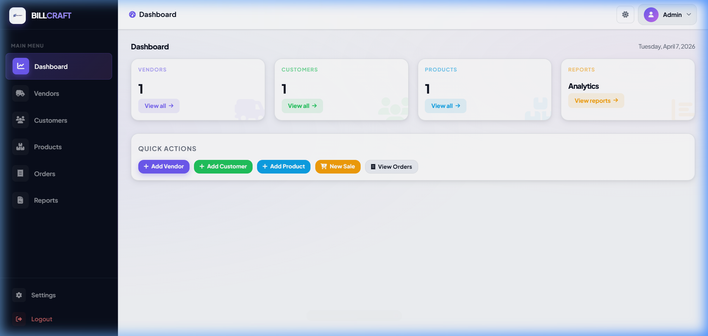
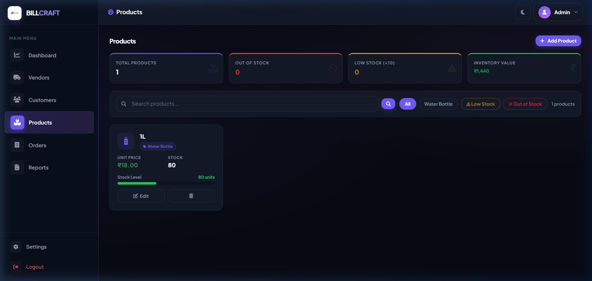

<div align="center">
  <a href="https://0xsharon.github.io/billcraft/">
    
  </a>
  <h1>💎 Billcraft — Modern Business Management &amp; Invoicing System</h1>
  <p><strong>High-performance, glassmorphic ERP, Inventory, CRM, and POS Invoicing Suite built for modern enterprises.</strong></p>

  <p>
    <a href="https://0xsharon.github.io/billcraft/"></a>
    <a href="https://github.com/0xSHARON/billcraft/stargazers"></a>
    <a href="https://www.php.net/"></a>
    <a href="https://www.mysql.com/"></a>
    <a href="LICENSE.md"></a>
  </p>
</div>

---

> 🚀 **Experience Billcraft in Your Browser Right Now:**
> 
> A complete, 1-to-1 interactive client-side simulation is hosted live on GitHub Pages with zero setup or database required:  
> 👉 **[https://0xsharon.github.io/billcraft/](https://0xsharon.github.io/billcraft/)**

---

## 📌 Overview

**Billcraft** is an enterprise-ready, full-featured Business Management and Point-of-Sale (POS) System developed by [Sharon Babu (0xSHARON)](https://github.com/0xSHARON). Designed for small to medium businesses, retail outlets, and technical service providers, Billcraft combines a modern glassmorphic dashboard with instant zero-reload AJAX operations, robust inventory stock alerts, customer CRM, vendor ledgers, and automated print-ready invoices with 1-click WhatsApp dispatch.

---

## ✨ Key Features

- **⚡ Instant Zero-Reload AJAX Engine**: Perform lightning-fast mutations. Record updates and deletions across Customers, Products, and Vendors occur seamlessly in real-time with smooth CSS fade-out animations.
- **🎨 State-of-the-Art Glassmorphism UI**: Engineered using CSS design tokens with adaptive Dark and Light mode themes, frosted glass translucency, micro-animations, and responsive layout scaling.
- **🛒 Point-of-Sale (POS) & Live Cart**: Interactive cashier screen with real-time multi-product selection, dynamic subtotal, GST/tax calculation, and automated stock validation.
- **🧾 Instant PDF & Printable Invoices**: Generates clean, professional, print-ready invoices (`INV-3-2-1` format) complete with company branding, tax itemization, and customer details.
- **💬 1-Click WhatsApp Invoice Dispatch**: Directly generate pre-formatted WhatsApp payment reminders and invoice links for instant client communication.
- **📦 Multi-Tier Inventory Management**: Real-time stock status monitoring with threshold indicators (`Low Stock < 10` warning badges, `Out of Stock` blockers, and live stock progress bars).
- **👥 Customer Relationship Management (CRM)**: Track customer order history, aggregate spending, and contact information with 1-click order initiation.
- **🚚 Vendor & Supply Chain Ledger**: Maintain active supplier catalogs, contact persons, and categorical procurement logs.
- **📊 Financial Analytics & Reports**: High-level KPI summary cards for Revenue, Gross Margins, Receivable collection rates, and category distribution.
- **🔒 Hardened Backend Architecture**: Built with prepared PDO / MySQLi statements to eliminate SQL injection vulnerabilities and Bcrypt cryptographic hashing for session protection.

---

## 📸 Interface Preview

<div align="center">
  <p><strong>Light Theme Dashboard &amp; KPI Overview:</strong></p>
  
  <br><br>
  <p><strong>Dark Theme Products &amp; Inventory Management:</strong></p>
  
</div>

---

## 🛠️ Technology Stack

| Layer | Technologies |
| :--- | :--- |
| **Frontend** | HTML5, Modern CSS3 (Glassmorphism design tokens), JavaScript (ES6+), jQuery |
| **Typography &amp; Icons** | Plus Jakarta Sans, JetBrains Mono, FontAwesome 6.4.0 Pro Icons |
| **Backend** | PHP 8.0 / PHP 8.2 (Modular procedural architecture) |
| **Database** | MySQL 8.0+ / MariaDB (InnoDB engine with relational integrity) |
| **Security** | Parameterized Prepared Statements, Bcrypt Password Hashing, Session Guards |
| **Live Showcase** | GitHub Pages Static Client-Side Engine (`index.html` + `.nojekyll`) |

---

## 🌐 Live Demo & Interactive Sandbox

You can test every module of Billcraft immediately without installing PHP or MySQL:

1. Visit **[https://0xsharon.github.io/billcraft/](https://0xsharon.github.io/billcraft/)**
2. **Dashboard**: Inspect real-time KPI metrics and recent transactions.
3. **Products**: Try live search filtering, test category chips, add a new item via modal, or delete a product to observe the AJAX fade-out animation.
4. **Sell (POS)**: Check items in the catalog to see real-time subtotal, 18% GST, and Grand Total updates.
5. **Invoicing**: Click **"Generate Bill & Invoice"** to open the print-ready invoice dialog with 1-click WhatsApp messaging.
6. **Dark / Light Toggle**: Click the sun/moon icon in the topbar to test theme switching.

---

## 🚀 Local Installation & Setup

If you want to run the full PHP + MySQL backend locally on your web server:

### Prerequisites

- **PHP 8.0** or higher
- **MySQL 5.7+ / 8.0+** or MariaDB
- Web server such as **Apache**, **Nginx**, **XAMPP**, or **Laragon**

### Step-by-Step Instructions

1. **Clone the repository**
   ```bash
   git clone https://github.com/0xSHARON/billcraft.git
   cd billcraft
   ```

2. **Database Import**
   - Open your MySQL administration tool (e.g. phpMyAdmin, MySQL Workbench, or CLI).
   - Create a database named `billcraft`:
     ```sql
     CREATE DATABASE billcraft CHARACTER SET utf8mb4 COLLATE utf8mb4_unicode_ci;
     ```
   - Import the schema and seed data from `billcraft.sql`:
     ```bash
     mysql -u root -p billcraft < billcraft.sql
     ```

3. **Configure Database Credentials**
   - Open `connection.php` and verify/update your credentials:
     ```php
     <?php
     $con = mysqli_connect("localhost", "your_username", "your_password", "billcraft");
     if (mysqli_connect_errno()) {
         die("Database Connection Failed: " . mysqli_connect_error());
     }
     ?>
     ```

4. **Launch Local Server**
   - If using XAMPP/WampServer, move the folder into your `htdocs` or `www` directory.
   - Alternatively, use PHP's built-in development server:
     ```bash
     php -S localhost:8000
     ```
   - Access the application in your browser at `http://localhost:8000`.

---

## 🔑 Default Credentials

| Role | Username | Password |
| :--- | :--- | :--- |
| **Administrator** | `admin` | `admin` |

> ⚠️ **Important Security Notice:** Always update the default password immediately upon production deployment via the Settings module.

---

## 🔒 Security Practices

- **Zero SQL Injection**: All queries receiving user input use parameterized prepared statements (`$stmt = $con->prepare(...)`).
- **Cryptographic Protection**: Passwords are saved with standard Bcrypt algorithms (`password_hash` & `password_verify`).
- **Sanitized Outputs**: HTML special characters are escaped to prevent Cross-Site Scripting (XSS).

---

## 🤝 Contributing

Contributions, bug reports, and feature proposals are welcome!

1. Fork the Project
2. Create your Feature Branch (`git checkout -b feature/NewFeature`)
3. Commit your Changes (`git commit -m 'feat: add NewFeature'`)
4. Push to the Branch (`git push origin feature/NewFeature`)
5. Open a Pull Request

---

## 📄 License

This project is licensed under the MIT License — see the [LICENSE.md](LICENSE.md) file for details.

---

<div align="center">
  Crafted by <a href="https://github.com/0xSHARON"><strong>Sharon Babu (0xSHARON)</strong></a><br>
  Explore more projects at <a href="https://0xsharon.github.io/">0xsharon.github.io</a>
</div>